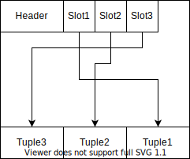
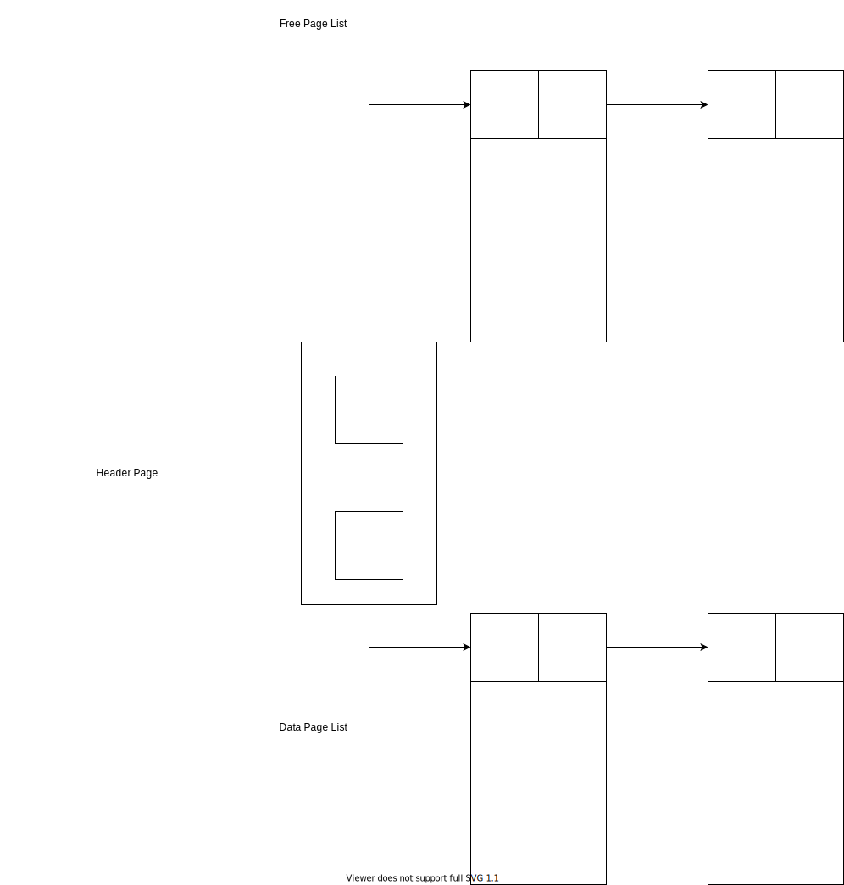

# Day04

今回はRDBMSのStorageの仕組みについて説明をしていきます｡

## Storage

前回の繰り返しとなりますが､RDBMSはnon-volatile(ストレージ)にあるデータをvolatile(メモリ､キャッシュ)において､操作します｡

non-volatileとvolatileを比較すると前者は容量は大きいですがアクセス速度は遅く､後者は容量は小さいですがアクセス速度は早いです｡また､non-volatileな記憶領域がテープ式の場合､テープ上で連続してデータが配置されている方がランダムに配置されている場合よりもアクセス速度が早いです｡そのため､これらを考慮する必要があります｡

メモリ上でのデータの展開はOSがやってくれる部分もありますが､連続した領域に配置するなど細かいものはRDBMS側でやる必要があります｡

## File

### Page

RDBMSではDBのfileを扱います｡その際にfileは`page`の集まりとして管理されます｡

`page`はデータの固定長ブロックで以下の要素を含みます｡

- `meta-data`
- `index`
- `log record`

### Tuple-oriented

`Tuple-oriented`という`Page`の構成について紹介します｡

それぞれの`page`は一意の識別子を持ちます｡また､`Header`として様々なデータが格納され､`Tuple`(行ごとのデータ)は以下のようにオブジェクトのメモリの先頭から`Slot`と呼ばれる`Tuple`を指すポインタが格納され､メモリの末尾に`Tuple`が格納されます｡ただし､`Tuple`は固定長のデータです｡そして､`Tuple`には一意な`record identifier`が付与されています｡

これによって削除､追加の際に効率的にメモリを使うことができます｡

### Page manipulation

追加時は以下のようになります｡

削除の際は以下の通り｡`Tuple`は後ろに詰められます｡

### Heap

`heap file`とは順序不同の`page`の集まりです｡`tuple`がランダムに格納されています｡そして､`page`は`CREATE`・`GET`・`WRITE`・`DELETE`がされ､全ての`page`を走査することも可能です｡

`heap`を表現する方法は`Linked List`と`Page Directory`の2種類があります｡

#### Linked List

`Linked List`は下図のように`Header Page`・`Free Page List`・`Data Page List`の3つの要素から構成されています｡

`Header Page`は`Free Page List`と`Data Page List`の先頭のノードへのポインタを持ち､`Free Page List`はデータの入っていない`Page`の単方向連結リスト､`Data Page List`はデータの入っている`Page`の単方向連結リストです｡

#### Page Directory

この方法は以下のように`Header Page`が連結リストになっていて､`Page`を指すという方法です｡自作RDBMSではこちらは採用しません｡

## 今回のまとめ

- `Page`という単位でRDBMSはファイルを扱う
- `Page`を扱うために2種類の方法があるが､自作RDBMSでは`Linked List`という方法を使う

## 次回予告

- MUST: Storageの説明を終わらせる
- SHOULD: 実装も終わらせる
